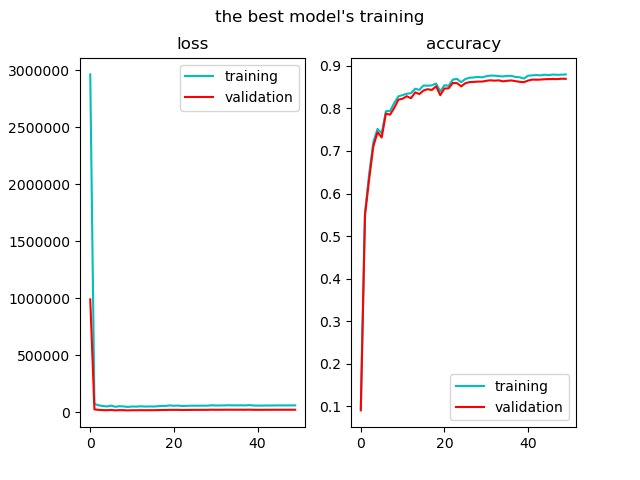
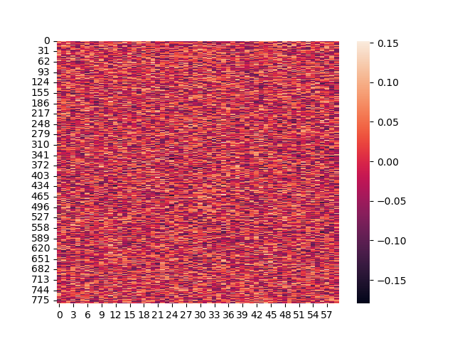
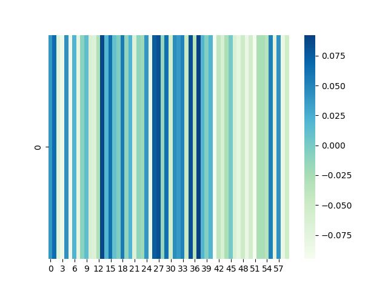
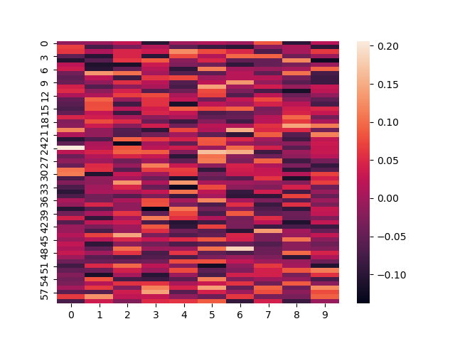
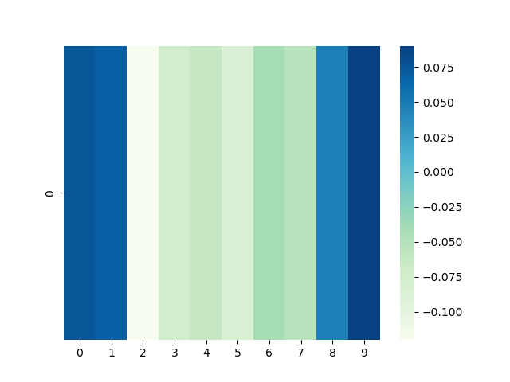

# DNN-2-layer

## GitHub & Google Drive
GitHub: https://github.com/Baderlic/DNN-2-layer   
Google Drive: https://drive.google.com/drive/folders/1t1q_Jo7dy-fEyUEnMV6Sac5mDXqV0gD8?usp=sharing

## 内容和代码
+ mnist.npz: MNIST数据集
+ model.py: 模型
+ training.py: 训练模型，存储模型，loss、accuracy曲线
+ test.py: 测试模型
+ visual.py: 可视化参数
+ model.pickle 训练得到的最佳模型(Google Drive)

## 使用顺序
1. training.py
2. test.py
3. visual.py

## 数据集
使用了给定的MNIST数据集，包括60000张手写数字的图像作用训练集和验证集，10000张作为测试集。其中有45000张作为训练集，15000张作为验证集。包括在training.py文件中。

## 神经网络的训练
由于使用了SGD算法，所以要对45000张图像分batch，选择batch size为30，分为1500个batch。选择epoch的数量为50（因为计算机运算速度限制）。训练主要有以下部分：
+ 前馈（feedforward）
+ 计算损失函数
+ 利用SGD反向传播更新参数
  
### 网络结构
两层的全连接网络。由于是分类问题，有10个类别，所以第二次必须是10个神经元。

### 激活函数
因为只有第一层是隐藏层，所以第一层用ReLu激活。由于这是分类问题，所以第二层在线性计算后用softmax处理为每个分类的概率。

### SGD

SGD需要随机选择的样本，利用随机选择的样本。这里是将45000个训练集样本分成2250个batch，从每个batch中随机选择一个样本做梯度下降。由于存在正则项，loss function在求导过程中需要注意正则项带来的额外变化。

### 搜索参数
根据题意选择两层的全连接网络，有三个待定的重要参数：
+ 学习率
+ 正则化系数
+ 隐藏层的神经元个数（第一层）
为了寻找最佳网络，各选择三个可能的取值，对27个网络进行训练，根据验证集上的准确率得到最佳网络。

| 学习率 | 正则化系数 | 隐藏层的神经元个数 |
|-|-|-|
|3e-3|2e-4|20|
|1e-3|1e-4|40|
|5e-4|5e-5|60|

### 学习率下降策略
这里采用了学习率下降策略，具体就是每过5个epoch学习率就下降到原来的一半，这就可以很好地改善学习率不变时靠近极值点时因为下降步长太大导致loss function反复横跳的现象。

## 训练的结果
最后通过验证集，可以得出验证集的最高accuracy为86.93%， 此时学习率为3e-3，正则化系数为5e-5， 隐藏层的神经元个数是60个。
### loss, accuracy曲线

  
上两图分别是最佳模型和普通模型对应的loss和accuracy曲线.可以看出两个模型在训练集上的accuracy非常接近，但是在验证集上有明显的差距。
### 可视化参数
训练得到的最佳模型的参数的热力图如下：  
第一层：

第二层：

   
上图分别表示为第一层和第二层的参数W和b的热力图。其中第一层W1的结构是784，b1的结构是$1\times60$第二层的参数结构是$60\times10$, b2的结构是$1\times10$。
## 测试结果
将minist数据集中10000个测试样本用于最终模型的测试，得到测试集的accuracy为**88.46%**。
